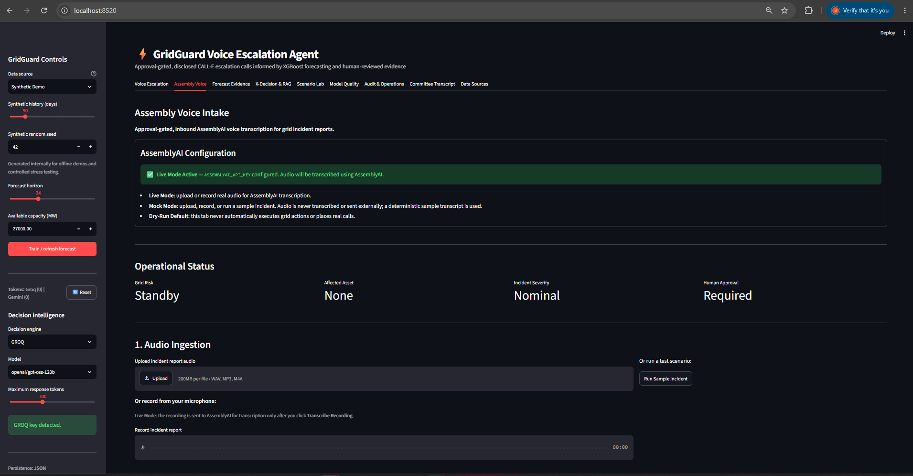
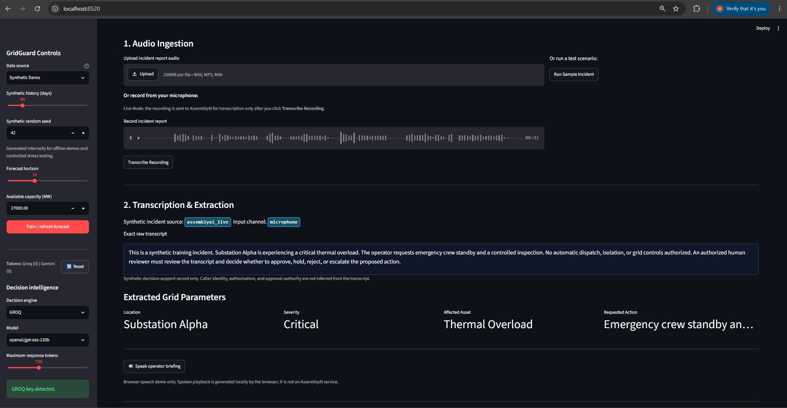
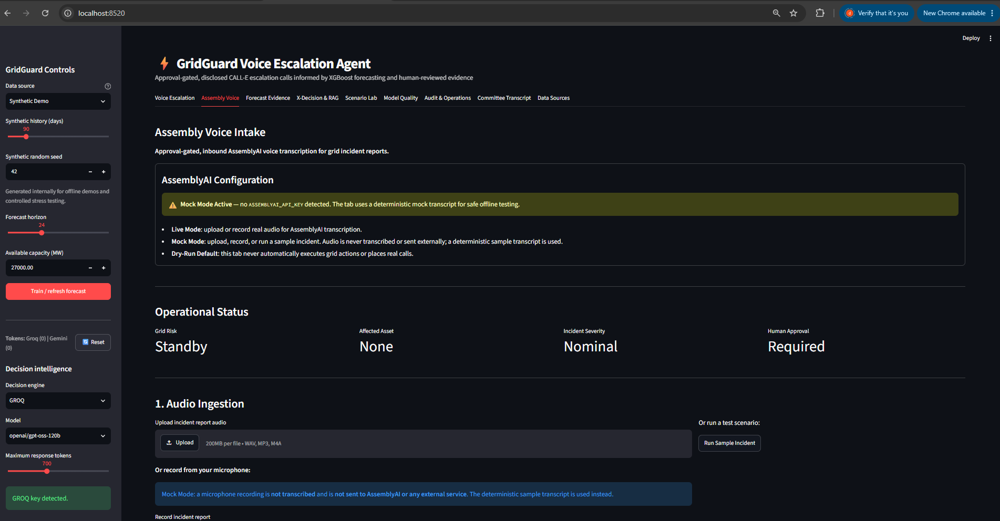
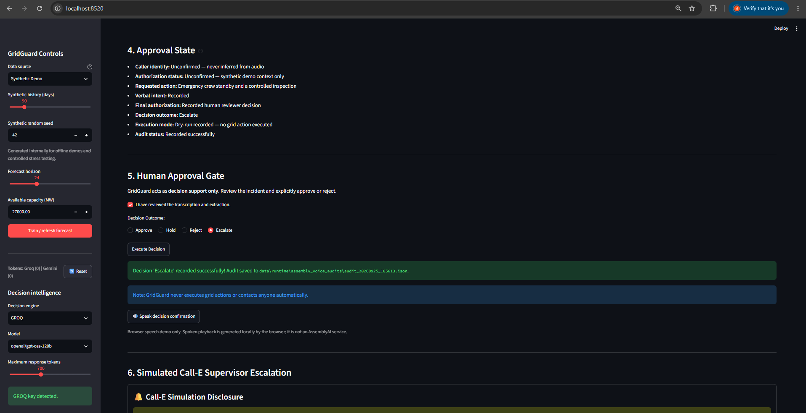
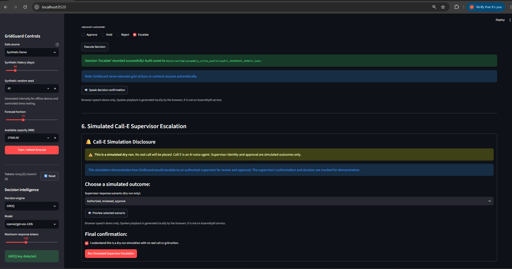
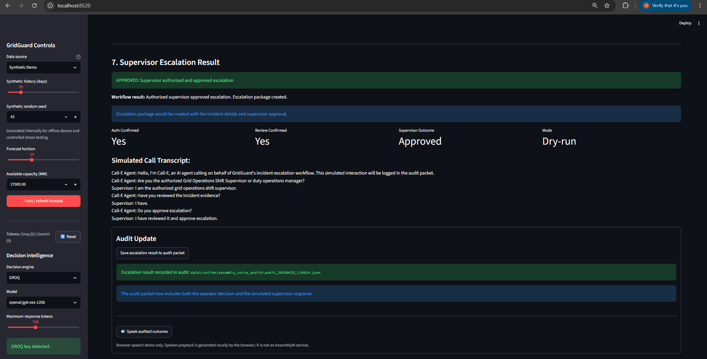
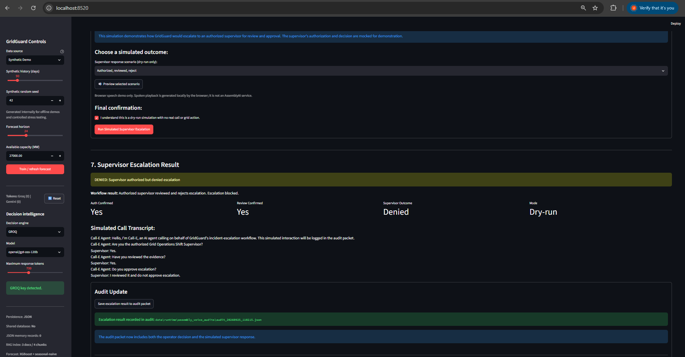

# GridGuard AssemblyAI Voice Agent Integrated

Approval-gated, inbound AssemblyAI voice transcription with local dry-run supervisor escalation simulation.

In the Assembly Voice workflow, Call-E supervisor escalation is a local dry-run simulation. Optional Live Mode sends audio to AssemblyAI only for transcription; the Assembly Voice workflow does not invoke a real Call-E request, place a telephone call, or execute a grid action.

## Integrated Application

This repository is the **GridGuard integrated dashboard**. Launch it with `streamlit run streamlit_app.py`.

- **Assembly Voice** is the second tab, immediately after **Voice Escalation**.
- The existing **GridGuard Controls** sidebar and all other GridGuard tabs remain available and unchanged.
- Assembly Voice is an approval-gated voice-intake workflow inside the dashboard; it does not replace **Voice Escalation**.

## Features
- **Upload Incident Audio**: Accepts `.wav`, `.mp3`, and `.m4a` files.
- **AssemblyAI Transcription**: Uses the official AssemblyAI Python SDK to transcribe audio incidents.
- **Mock Mode**: Fully functional offline mock mode when `ASSEMBLYAI_API_KEY` is not provided. The microphone recorder is disabled in Mock Mode; audio upload and **Run Sample Incident** remain available, and no audio is sent to AssemblyAI or any other external service.
- **Entity Extraction**: Extracts incident location, severity, affected asset, and requested action.
- **Voice Conversation Workflow**: Demonstrates a credible operational timeline where AssemblyAI provides the initial transcription, a deterministic demo authorization service verifies the caller's role (note: this is a mock directory lookup, not biometric or voice authentication), and an explicit on-screen human approval gate must be cleared before any action is recorded.
- **Human-in-the-loop Governance**: Strict approval gate requiring human consent before decisions are executed.
- **Audit Logging**: JSON-based audit packet logging.

## Windows Setup Instructions

### 1. Requirements
Ensure you have Python 3.8+ installed.

### 2. Virtual Environment Setup
It is recommended to use a virtual environment.
```powershell
# Create virtual environment
python -m venv venv

# Activate virtual environment
.\venv\Scripts\activate
```

### 3. Install Dependencies
```powershell
pip install -r requirements.txt
```

### 4. Configuration
Create a `.env` file based on `.env.example`:
```powershell
copy .env.example .env
```
If you want to test live transcription, add your AssemblyAI API key to `.env`:
```
ASSEMBLYAI_API_KEY=your_actual_key_here
```
If you leave it blank, the app runs in **Mock Mode**, allowing you to test the workflow safely.

### 5. Running Tests
To verify the extraction logic and audit gates:
```powershell
pytest tests/
```

### 6. Run the Application
Launch the Streamlit interface:
```powershell
streamlit run streamlit_app.py
```
The application will open in your default browser at `http://localhost:8501`.

## Demo Walkthrough

GridGuard supports both:
* **Live Mode**: AssemblyAI transcribes uploaded or recorded audio (optional; requires `ASSEMBLYAI_API_KEY`). The recorder is enabled, and audio is sent to AssemblyAI only after the user explicitly chooses to transcribe it.
* **Mock Mode**: deterministic offline fallback for safe testing when the API key is not provided. The microphone recorder is disabled; audio upload and **Run Sample Incident** remain available, and no audio is sent to AssemblyAI or any other external service.
* **Dry-run by default**: all proposed actions require explicit human approval and are audit logged; no real grid action, telephone call, or external escalation occurs.

1. **Assembly Voice tab in the integrated dashboard:** The **Assembly Voice** tab sits second in the tab bar, right after **Voice Escalation**, and leaves the GridGuard Controls sidebar unchanged. The screenshot shows the tab in Live Mode (`ASSEMBLYAI_API_KEY` configured), with the AssemblyAI Configuration status panel, the Operational Status metrics, and the start of the Audio Ingestion section.


2. **Live Mode microphone recording:** Audio is sent to AssemblyAI for transcription only after the user selects **Transcribe Recording**. The resulting incident record identifies the source as `assemblyai_live` and the input channel as `microphone`, shows the exact raw transcript, and lists the extracted grid parameters (location, severity, affected asset, requested action).


3. **Mock Mode local transcript:** With no `ASSEMBLYAI_API_KEY` configured, the tab shows **Mock Mode Active**. The notice in the screenshot states that a microphone recording is not transcribed and is not sent to AssemblyAI or any external service, and that the deterministic sample transcript is used instead. In the current version of the tab the microphone recorder is disabled in Mock Mode (upload and **Run Sample Incident** remain available); this screenshot predates that change.


4. **Operator selects Escalate:** The operator confirms **I have reviewed the transcription and extraction**, selects **Escalate**, and selects **Execute Decision**. The Approval State lists the decision outcome as Escalate with execution mode "Dry-run recorded — no grid action executed", and the local audit file path is shown. The note reads that GridGuard never executes grid actions or contacts anyone automatically.


5. **Call-E dry-run confirmation:** After an Escalate decision, the tab shows a simulated Call-E supervisor escalation with a disclosure that it is a dry-run, that no real call will be placed, and that Call-E is an AI voice agent. The operator picks a simulated supervisor scenario (here "Authorized, reviewed, approve") and ticks a separate final confirmation before **Run Simulated Supervisor Escalation** is used.


6. **Approved supervisor outcome:** The simulated result shows **APPROVED** with Auth Confirmed Yes, Review Confirmed Yes, Supervisor Outcome Approved, and Mode Dry-run, followed by the simulated call transcript. After **Save escalation result to audit packet**, the tab confirms the audit packet includes both the operator decision and the simulated supervisor response.


7. **Denied supervisor outcome:** For the scenario "Authorized, reviewed, reject", the simulated result shows **DENIED** with Auth Confirmed Yes, Review Confirmed Yes, Supervisor Outcome Denied, and Mode Dry-run; the workflow result reads "Escalation blocked". The result is saved to the audit packet the same way.



### Optional read-aloud demo script

For a repeatable microphone demonstration, open the included script at:

[`demo-scripts/audio_ingestion_script.txt`](demo-scripts/audio_ingestion_script.txt)

Read the incident aloud into the **Assembly Voice** tab and select **Transcribe Recording**.

- **Live Mode:** the recording is sent to AssemblyAI for transcription.
- **Mock Mode:** the microphone recorder is disabled and the app uses the deterministic sample incident instead.
- **Run Sample Incident:** provides a no-audio, no-API demonstration.

This workflow is approval-gated and dry-run only. It performs no real grid action, telephone call, or external escalation.

### Browser-local spoken controls in Assembly Voice

The Assembly Voice tab includes four optional browser-local text-to-speech controls. Each uses the browser's native **Web Speech API** and is triggered only by explicit user click—no autoplay, no AssemblyAI text-to-speech service, no external API, no paid service.

1. **Speak operator briefing** — After incident transcript extraction (Section 2)
   - Reads extracted location, severity, affected asset, and requested action
   - Ends with: "Please review the extracted details before selecting a decision."
   - Informs operator; does not change state

2. **Speak decision confirmation** — After Gate 5 decision is recorded (Section 5)
   - Reads the recorded decision (Approve, Hold, Reject, or Escalate)
   - Confirms: "This workflow remains a simulated dry run. No real grid action, telephone call, or external escalation has occurred."
   - Informs operator; does not trigger escalation

3. **Preview selected scenario** — After selecting simulated supervisor outcome, before final confirmation (Section 6)
   - Reads the chosen scenario (e.g., "Authorized, reviewed, and approving escalation")
   - Ends with: "This is a dry-run preview only. No real call, grid action, or escalation has occurred."
   - Previews; does not execute simulation

4. **Speak audited outcome** — Only after simulated escalation result is saved to audit packet (Section 7)
   - Reads the recorded decision, supervisor outcome, and confirmation that audit was saved
   - Confirms: "This remains a dry-run. No real call, grid action, or external escalation has occurred."
   - Summarizes; does not change state or bypass approval

All four controls include a caption: **"Browser speech demo only. Spoken playback is generated locally by the browser; it is not an AssemblyAI service."**

Speech changes approval behavior in no way. Only on-screen checkboxes, radio buttons, and explicit audit saves control the workflow.


## End-to-End Workflow

1. **Audio Ingestion** (Section 1)
   - Choose one input channel:
     - **Microphone** (Live Mode only): record directly via `st.audio_input()`; the recorder is disabled in Mock Mode with a short explanation
     - **Upload**: select a `.wav`, `.mp3`, or `.m4a` file (available in Live and Mock Mode)
     - **Sample**: run a deterministic test incident (available in Live and Mock Mode)
   - Click "Transcribe Audio", "Transcribe Recording" (Live Mode only), or "Run Sample Incident"

2. **Transcription & Extraction** (Section 2)
   - **Live Mode** (if `ASSEMBLYAI_API_KEY` is set): the recorder is enabled, and audio is sent to AssemblyAI for live transcription only after the user explicitly chooses to transcribe it
   - **Mock Mode** (if key is blank): the recorder is disabled; audio is not sent to AssemblyAI or any other external service, and the app uses a deterministic canned transcript
   - Extracted incident details: location, severity, affected asset, requested action, incident ID
   - Input channel is recorded in the audit: microphone, upload, or sample

3. **Conversation Review Panel** (Section 3)
   - Displays a synthetic conversation timeline showing operator and agent exchange
   - No biometric, voice, or directory authentication is claimed
   - Demonstrates what a supervisor would hear (mock only)

4. **Operator Approval Gate** (Section 5)
   - **Checkbox**: "I have reviewed the transcription and extraction"
   - **Radio selection**: Approve, Hold, Reject, or **Escalate**
   - **Button**: "Execute Decision"
   - Any decision is recorded in the audit packet with timestamp

5. **Decision Outcomes**
   - **Approve**: Operator approves the incident response; audit is saved; workflow ends
   - **Hold**: Operator places decision on hold; audit is saved; workflow ends
   - **Reject**: Operator rejects the incident; audit is saved; workflow ends
   - **Escalate**: Operator requests supervisor escalation; Section 6 appears with dry-run call simulation (see below)

6. **Call-E Dry-Run Supervisor Escalation** (Section 6, visible only after Escalate)
   - **Disclosure Banner**:
     - "Call-E is an AI agent"
     - "This is a simulated dry-run. No real call will be placed."
     - "Supervisor identity and approval are simulated outcomes only"
   - **Scenario Selector**: Choose a simulated supervisor outcome
     - Authorized, reviewed, approve
     - Authorized, reviewed, reject
     - Not authorized / wrong person
     - Authorized, not reviewed
     - Call-E execution failure (simulated provider error)
   - **Second Confirmation Checkbox**: "I understand this is a dry-run simulation with no real call or grid action"
   - **Button**: "Run Simulated Supervisor Escalation"
   - The simulated transcript includes: Call-E self-identifying as an AI agent, no external call or network activity

7. **Supervisor Response & Result** (Section 7, after simulation runs)
   - **Status**: Shows canonical outcome (Approved, Denied, Unavailable, or Failed)
   - **Metrics**: Auth Confirmed, Review Confirmed, Supervisor Outcome, Mode
   - **Simulated Transcript**: Full mock conversation
   - **Audit Button**: "Save escalation result to audit packet"

8. **Audit Packet** (Final)
   - Saved as JSON in `data/runtime/assembly_voice_audits/`
   - Contains:
     - Timestamp (UTC ISO format with Z suffix)
     - Original transcript
     - Incident details (location, severity, asset, action, ID)
     - Input channel (microphone, upload, or sample)
     - Source (mock or assemblyai_live)
     - Operator decision and outcome state
     - Supervisor escalation result (if applicable): auth_confirmed, review_confirmed, approval_decision, supervisor_outcome, workflow_result, simulated transcript
     - `dry_run: true` (always; no real action is ever executed)

## Decision and Supervisor Outcomes

| Operator Decision | Audit Status | Call-E Simulation | Supervisor Outcome | Next Step |
|---|---|---|---|---|
| **Approve** | Recorded | No | N/A | Workflow ends |
| **Hold** | Recorded | No | N/A | Workflow ends |
| **Reject** | Recorded | No | N/A | Workflow ends |
| **Escalate** | Recorded | Yes (dry-run only) | Approved, Denied, Unavailable, or Failed | Save to audit |

**Supervisor Outcomes** (when Escalate is chosen):
- **Approved**: Authorized supervisor reviewed and approved the escalation
- **Denied**: Authorized supervisor reviewed and denied the escalation
- **Unavailable**: Supervisor not authorized or not available for review
- **Failed**: Simulated Call-E execution failure (no contact established)

## Safety Boundaries

**What the Assembly Voice workflow does NOT do:**

- ❌ The Assembly Voice workflow does not invoke a real Call-E request, place a telephone call, or execute a grid action (it uses no Call-E SDK or API key)
- ❌ No phone number (E.164 format) is stored or dialed
- ❌ No biometric voice authentication or verification
- ❌ No real supervisor identity verification (simulated only)
- ❌ No emergency dispatch or grid action execution
- ❌ No WebSocket streaming or real-time call signaling
- ❌ No automatic action without explicit human approval

**What is guaranteed:**

- ✓ **Dry-run by default**: `dry_run: true` in every audit packet
- ✓ **Two approval gates**: Operator must approve before decision is recorded; second confirmation required before supervisor simulation runs
- ✓ **AI disclosure**: Simulated Call-E agent explicitly identifies itself as an AI agent in the transcript
- ✓ **Mock Mode safety**: The recorder is disabled and audio is never sent to AssemblyAI or any other external service if the API key is not configured
- ✓ **Audit trail**: Complete transcript of all decisions and simulated outcomes
- ✓ **Local simulation**: In the Assembly Voice workflow, all supervisor escalation is computed locally; no external network calls for Call-E

The separate **Voice Escalation** tab keeps its own approval-gated CALL-E behavior (dry-run by default) and is not changed by Assembly Voice.

## Architecture

```mermaid
flowchart TD
    Start([User opens GridGuard dashboard]) --> Tab["Select Assembly Voice tab<br/>(next to Voice Escalation)"]
    Tab --> Input{Input channel}
    Input -->|Microphone| Mic["Record audio<br/>via st.audio_input"]
    Input -->|Upload| Upload["Select .wav, .mp3, .m4a<br/>file"]
    Input -->|Sample| Sample["Run deterministic<br/>test incident"]

    Mic --> CheckKey{ASSEMBLYAI_API_KEY<br/>configured?}
    Upload --> CheckKey
    Sample --> Mock

    CheckKey -->|Yes| Live["Live Mode:<br/>Send audio to AssemblyAI<br/>Get transcript"]
    CheckKey -->|No| Mock["Mock Mode:<br/>Use deterministic<br/>canned transcript<br/>(no external call)"]

    Live --> Extract["Extract incident details:<br/>location, severity, asset,<br/>requested action, ID"]
    Mock --> Extract

    Extract --> Display["Display transcript &<br/>extracted details"]
    Display --> Speak1["🔊 Speak operator briefing<br/>(optional, browser-local)<br/>User click only"]
    Speak1 --> Gate["Operator Approval Gate:<br/>Review & choose outcome"]

    Gate --> Decision{Operator<br/>Decision}
    Decision -->|Approve| RecordDec["Record decision<br/>in audit packet"]
    Decision -->|Hold| RecordDec
    Decision -->|Reject| RecordDec
    Decision -->|Escalate| RecordDec
    
    RecordDec --> Speak2["🔊 Speak decision confirmation<br/>(optional, browser-local)<br/>User click only"]
    Speak2 --> CheckEsc{Escalate?}
    CheckEsc -->|No| End1["Workflow ends<br/>dry_run: true"]
    CheckEsc -->|Yes| Confirm["Second Confirmation:<br/>Checkbox required:<br/>Acknowledge this is<br/>a dry-run simulation"]

    Confirm --> ScenarioSelect["Select supervisor<br/>outcome scenario"]
    ScenarioSelect --> Speak3["🔊 Preview selected scenario<br/>(optional, browser-local)<br/>User click only"]
    Speak3 --> FinalConfirm["Final confirmation checkbox:<br/>Understand this is dry-run"]
    
    FinalConfirm --> SimCall["Local Call-E Simulation:<br/>- AI agent self-identifies<br/>- Compute supervisor response<br/>(no network call, no real action)"]

    SimCall --> Result["Supervisor Result:<br/>Approved/Denied/<br/>Unavailable/Failed"]
    Result --> Audit2["Record operator decision<br/>+ supervisor result<br/>in audit packet"]

    Audit2 --> Speak4["🔊 Speak audited outcome<br/>(optional, browser-local)<br/>User click only"]
    Speak4 --> End2["Workflow ends<br/>dry_run: true"]

    style Live fill:#e1f5ff,color:#000000
    style Mock fill:#fff3e0,color:#000000
    style Audit1 fill:#e8f5e9,color:#000000
    style Audit2 fill:#e8f5e9,color:#000000
    style SimCall fill:#f3e5f5,color:#000000
    style Speak1 fill:#fff9c4,color:#000000
    style Speak2 fill:#fff9c4,color:#000000
    style Speak3 fill:#fff9c4,color:#000000
    style Speak4 fill:#fff9c4,color:#000000
```



**Key design points:**
- **Input diversity**: Upload and the deterministic sample are always available, so offline testing is always possible; the microphone recorder is enabled only in Live Mode
- **Mode toggle**: Live/Mock decision is automatic; respects `ASSEMBLYAI_API_KEY` presence, not a user choice
- **Human gates**: Two explicit checkboxes and one decision radio ensure intentional approval
- **Browser-local spoken output**: Four optional text-to-speech controls use the browser's native Web Speech API (not AssemblyAI text-to-speech or Voice Agent API). Each is user-click-only with no autoplay or state change. They provide operational context and confirm workflow stages; they do not affect approval or escalation.
- **Local simulation**: In the Assembly Voice workflow, supervisor escalation is computed entirely offline; no external API calls for Call-E
- **Audit completeness**: Both operator and simulated supervisor decisions are captured in one JSON packet with `dry_run: true`
